# Windows and Linux Infrastructure Home Lab

## About this project

This is my first Windows and Linux infrastructure home lab. I created it to practise the basics of Windows Server, Active Directory, networking, file sharing, Group Policy and Linux administration.

I built the lab in Oracle VirtualBox and kept the environment separate from my normal computer network.

## Lab environment

```text
Oracle VirtualBox
└── ADLAB NAT Network — 10.10.10.0/24
    ├── DC01      — 10.10.10.10
    ├── CLIENT01  — 10.10.10.20
    └── LINUX01   — 10.10.10.30
```

| Machine | Operating system | Purpose |
|---|---|---|
| DC01 | Windows Server 2022 | Active Directory Domain Services and DNS |
| CLIENT01 | Windows 11 | Domain-joined workstation |
| LINUX01 | Ubuntu Server 24.04 LTS | SSH and Apache server |

## 1. Virtual network

I created a VirtualBox NAT Network named `ADLAB` with the `10.10.10.0/24` subnet. All three virtual machines were connected to this network so they could communicate with each other.

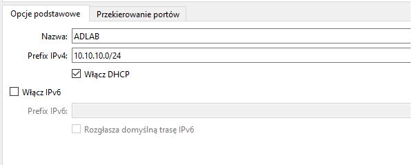

I assigned static IPv4 addresses to the virtual machines. DC01 uses `10.10.10.10` and also uses its own address as the DNS server.

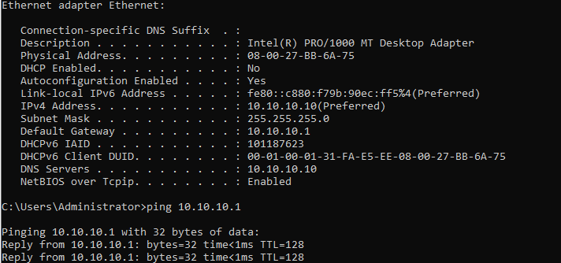

## 2. Active Directory and DNS

I installed Active Directory Domain Services and created the `adlab.test` domain. The server name is `DC01` and the NetBIOS domain name is `ADLAB`.

I used PowerShell to confirm that the domain was available.

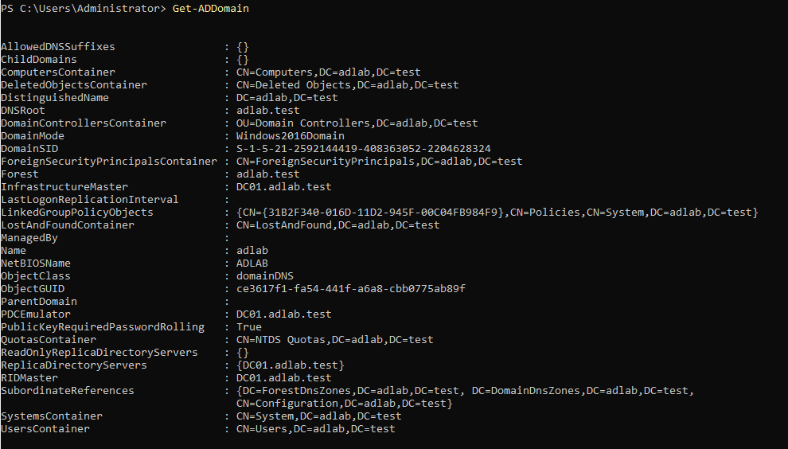

I also ran a DNS diagnostic test. DC01 passed the connectivity and DNS tests.

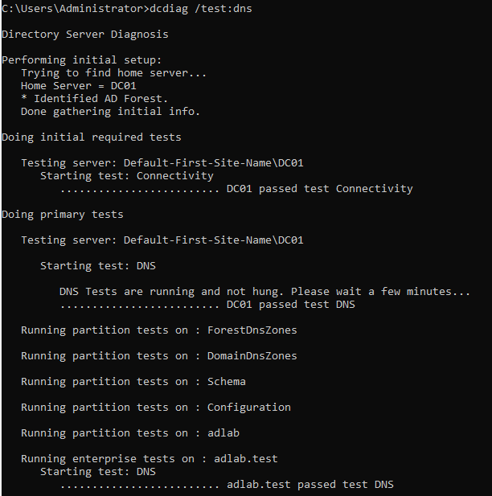

## 3. Users, groups and Organizational Units

I created a basic Organizational Unit structure for users, groups, workstations, servers and disabled users.

I added two test accounts:

- Bob Smith
- Mike Zawosky

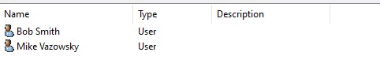

I created security groups for IT users and file-share access:

- `IT_Users`
- `IT_Share_RW`
- `IT_Share_RO`

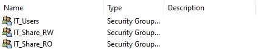

## 4. Windows client and domain login

I configured CLIENT01 with the static address `10.10.10.20` and set its DNS server to `10.10.10.10`, which is the address of DC01.

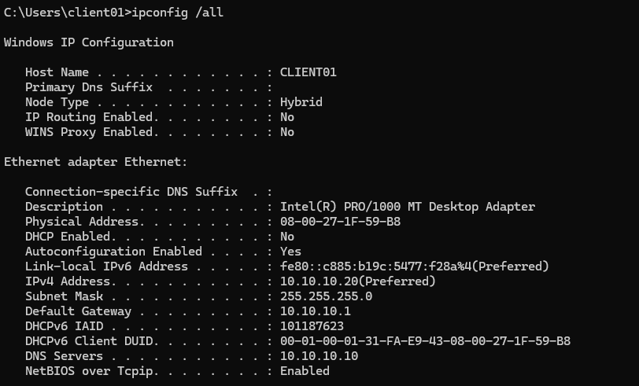

I joined CLIENT01 to the `adlab.test` domain and moved the computer object to the `Workstations` Organizational Unit.

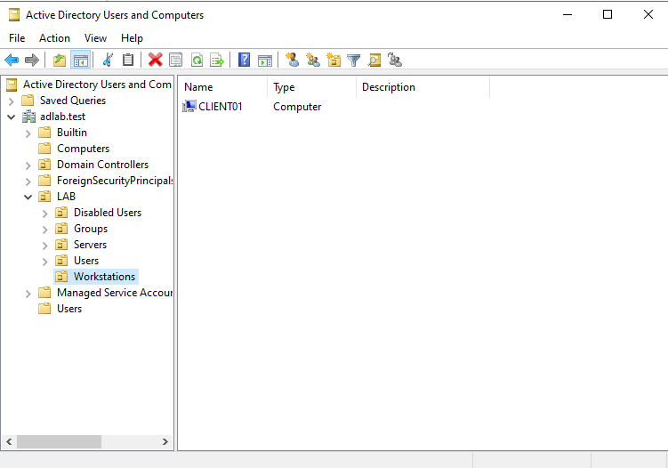

I logged in with the domain account `ADLAB\bob.smith`. I used PowerShell to confirm the current user, the logon server and the secure channel to the domain.

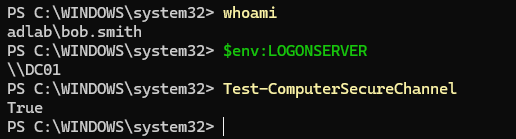

## 5. File share and permissions

I created an SMB share on DC01 and assigned different permissions to two Active Directory groups:

- `IT_Share_RW` for read and write access
- `IT_Share_RO` for read-only access

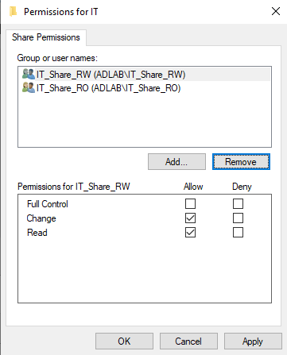

Bob Smith was able to create a file in the shared folder. The file properties show Bob as the owner.

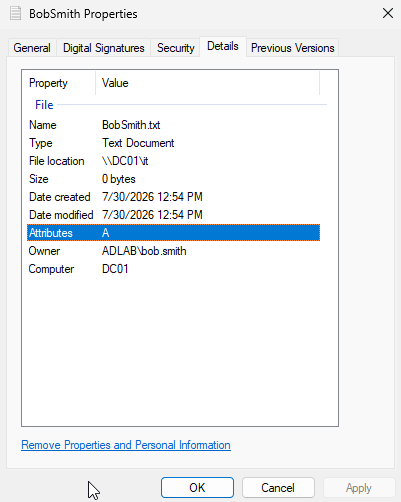

Mike was able to access an existing file from the shared folder. When he tried to save changes, Windows displayed a permission error because his account belonged to the read-only group.

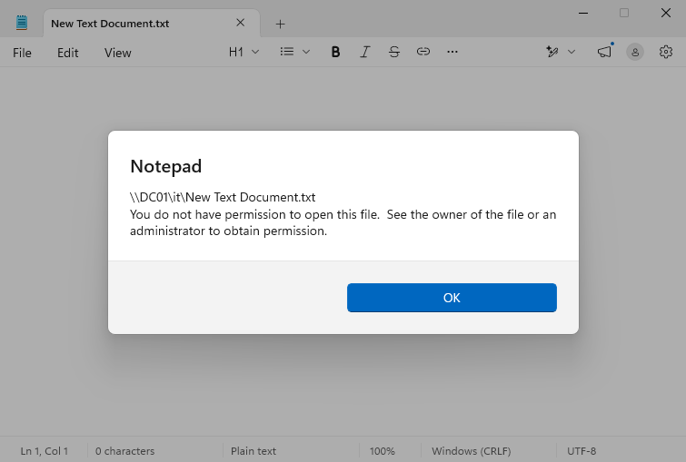

This test confirmed that the read/write and read-only groups had different access levels.

## 6. Group Policy drive mapping

I created a Group Policy Preference that maps the shared folder as drive `S:` with the label `IT Share`.

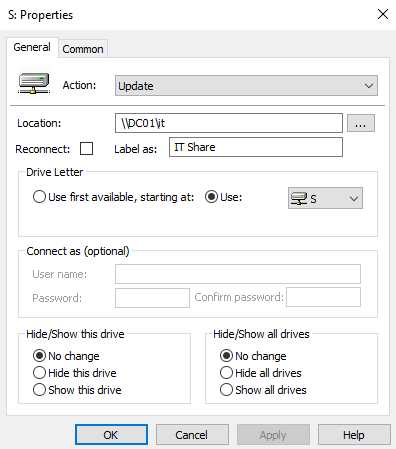

The mapped drive appeared on CLIENT01 after the Group Policy update and user login.

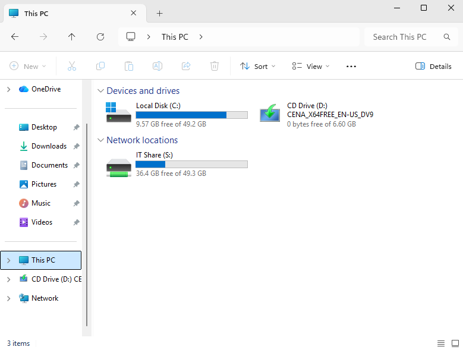

## 7. Ubuntu Server

I configured LINUX01 with the static address `10.10.10.30`.

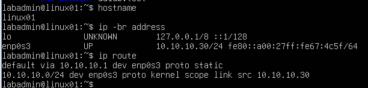

I installed and enabled OpenSSH and Apache. I also enabled UFW and allowed SSH and Apache traffic.

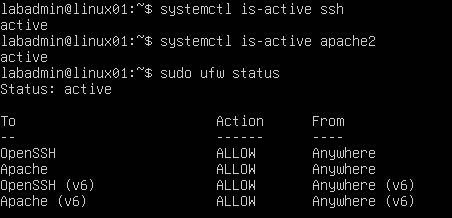

I connected to LINUX01 through SSH from a Windows terminal and verified the hostname, username and IP address.

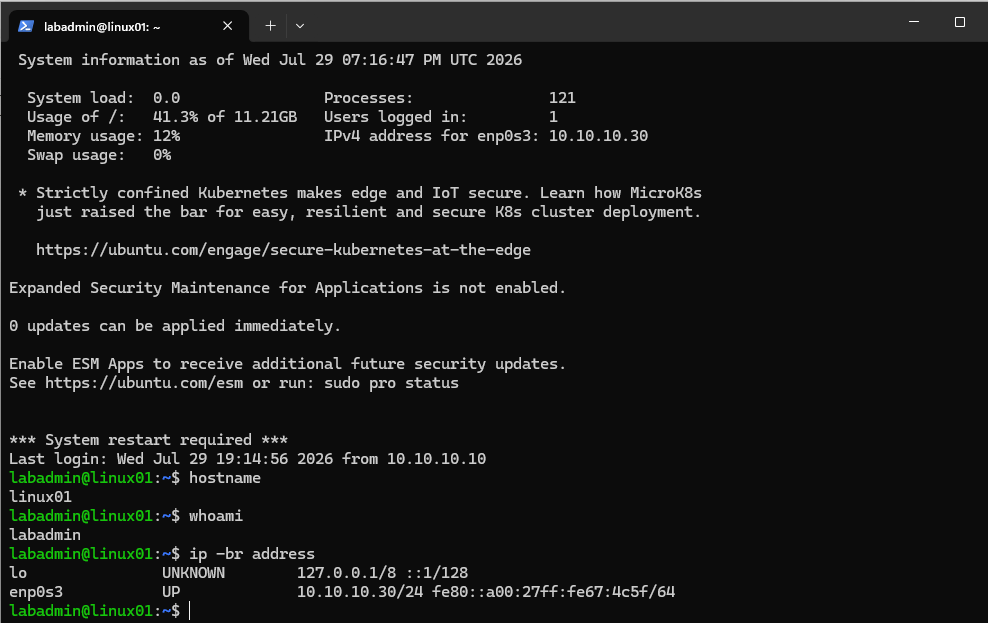

I created a simple Apache page and opened it from the Windows client.

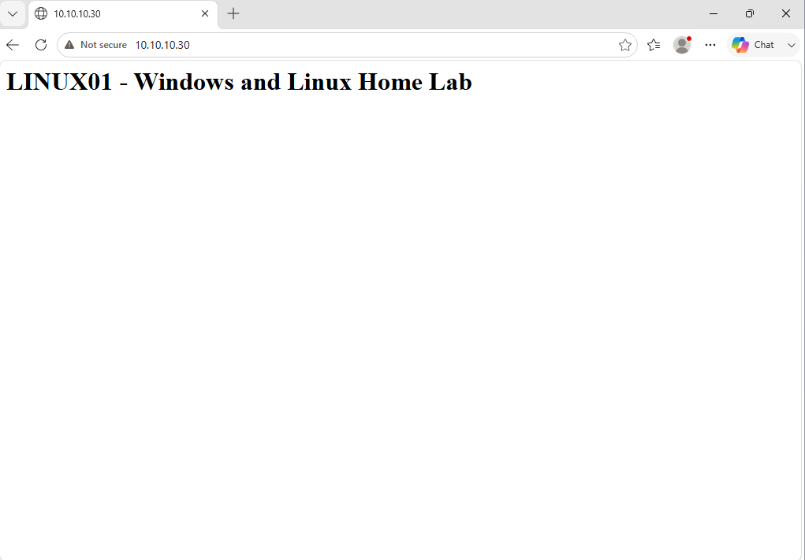

## Problems I encountered

### VirtualBox NAT and NAT Network

At first, the virtual machines used the normal NAT mode. I learned that a shared NAT Network was a better choice for this lab because the machines needed to communicate with each other. I created the `ADLAB` NAT Network and connected all three machines to it.

### Active Directory DNS lookup

One SRV lookup failed because I typed `_msdc` instead of `_msdcs`. After correcting the command, I was able to verify the domain controller records.

### Share permissions

I had to understand the difference between share permissions and NTFS permissions. I tested the setup with two users: Bob could create and edit files, while Mike could read a file but could not save changes.

## What I learned

This project helped me practise:

- creating and configuring virtual machines in VirtualBox,
- static IPv4 addressing and basic network testing,
- installing Active Directory Domain Services and DNS,
- creating users, groups and Organizational Units,
- joining a Windows workstation to a domain,
- logging in with a domain account,
- testing the computer secure channel,
- configuring an SMB share and group-based permissions,
- mapping a network drive with Group Policy,
- basic Ubuntu Server administration,
- installing and checking Linux services,
- configuring UFW,
- using SSH from Windows,
- hosting a simple Apache page.

## Next steps

- Configure DHCP on Windows Server and disable VirtualBox DHCP.
- Practise password resets, account unlocking and disabled accounts.
- Create a simple PowerShell script for adding test users.
- Review Windows Event Viewer logs.
- Add basic monitoring and security logging later.

## Project status

Version 1 is complete. The core Windows and Linux environment is working, including Active Directory, DNS, domain login, group-based file permissions, Group Policy drive mapping, SSH and Apache.
